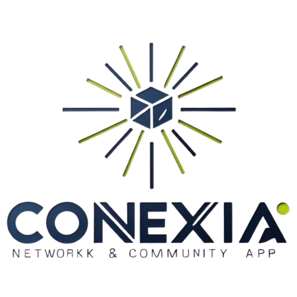

# Conexia App



Conexia es una aplicación web moderna y dinámica desarrollada con Next.js 14, React 18 y TypeScript. Diseñada para demostrar las mejores prácticas en el desarrollo frontend, Conexia consume datos de JSONPlaceholder a través de los endpoints de usuarios, publicaciones y comentarios, integrando estas fuentes en una experiencia de usuario coherente e intuitiva.

## Tabla de Contenidos

- [Primeros Pasos](#primeros-pasos)
- [Descripción](#descripción)
- [Características](#características)
- [Construcción](#construcción)
- [Decisiones Técnicas](#decisiones)
- [Contribuciones](#contribuciones)
- [Licencia](#licencia)
- [Autor](#autor)

## Primeros pasos

First, Install dependencies:

```bash
yarn install
```

Second, run the development server:

```bash
npm run dev
# or
yarn dev
# or
pnpm dev
# or
bun dev
```

Open [http://localhost:3000](http://localhost:3000) with your browser to see the result.

## Caracteristicas

La aplicación permite:

- Visualizar y filtrar usuarios: En la página principal, se listan todos los usuarios con información esencial y se puede filtrar la lista dinámicamente por nombre o username.
- Explorar publicaciones: Una sección dedicada muestra las publicaciones, con opciones para ordenar y filtrar por título, e incluso implementar paginación o carga infinita.
- Ver detalles y comentarios: Al seleccionar un usuario o publicación, se accede a una vista detallada que muestra información adicional, incluyendo comentarios relacionados.
- Interacción en tiempo real: Gracias a la integración de TanStack Query, la aplicación gestiona de forma eficiente el estado, la caché y la revalidación de datos, permitiendo agregar comentarios de manera interactiva.

Con un diseño adaptable y enfocado en el rendimiento, Conexia utiliza estrategias avanzadas como Server Components y SSR para optimizar la experiencia del usuario, demostrando una sólida arquitectura y una cuidada organización del código.

## Construcción

Este proyecto está construido utilizando las siguientes tecnologías y herramientas:

- **React 18**: Una biblioteca de JavaScript para construir interfaces de usuario.
- **Next.js 14**: Un framework de React para aplicaciones web con renderizado del lado del servidor.
- **TypeScript**: Un superset de JavaScript que añade tipos estáticos.
- **React Query (TanStack Query)**: Una biblioteca para el manejo de estado y caché de datos en React.
- **ShadCN**: Un conjunto de componentes de interfaz de usuario para React.
- **Tailwind CSS**: Un framework de CSS para un diseño rápido y eficiente.

### Estructura del proyecto

La estructura del proyecto es la siguiente:

```
/conexia-app
├── node_modules/       # Dependencias del proyecto
├── public/             # Archivos públicos
├── src/                # Código fuente del proyecto
├── postcss.config.js   # Configuración de PostCSS
├── tailwind.config.js  # Configuración de Tailwind CSS
├── package.json        # Archivo de configuración de npm
└── README.md           # Documentación del proyecto
```

## Decisiones Técnicas

**Server Components vs. Client Components**:

- Utilicé Server Components para la carga inicial de datos, lo que mejora el SEO y el rendimiento inicial.
- Implementé Client Components para las partes interactivas como filtros y formularios.


**TanStack Query**:

- Utilicé TanStack Query para manejar el estado de los datos, caché y revalidación.
- Configuré un staleTime de 1 minuto para reducir peticiones innecesarias.
- Utilicé initialData para hidratar los datos del servidor, evitando parpadeos y mejorando la experiencia de usuario.


**ShadCN UI**:

- Implementé componentes de ShadCN UI para una interfaz consistente y accesible.
- Personalicé los componentes según las necesidades del proyecto.


**Optimizaciones de Rendimiento**:

- Implementé paginación en la lista de posts para mejorar el rendimiento.
- Utilicé line-clamp para limitar la longitud de textos largos.
- Implementé lazy loading para componentes que no se necesitan inmediatamente.

## Contribuciones

Las contribuciones son bienvenidas. Por favor, sigue los siguientes pasos para contribuir:

1. Haz un fork del repositorio.
2. Crea una nueva rama (git checkout -b feature/nueva-funcionalidad).
3. Realiza tus cambios y haz commit (git commit -am 'Añadir nueva funcionalidad').
4. Haz push a la rama (git push origin feature/nueva-funcionalidad).
5. Abre un Pull Request.

## Licencia

Este proyecto está licenciado bajo la Licencia MIT.

## Autor

Proyecto desarrollado por:

[Untalinfo - GitHub](https://github.com/untalinfo)

[LinkedIn](https://www.linkedin.com/in/untalinfo/)

[email: racso1607@gmail.com](racso1607@gmail.com)
